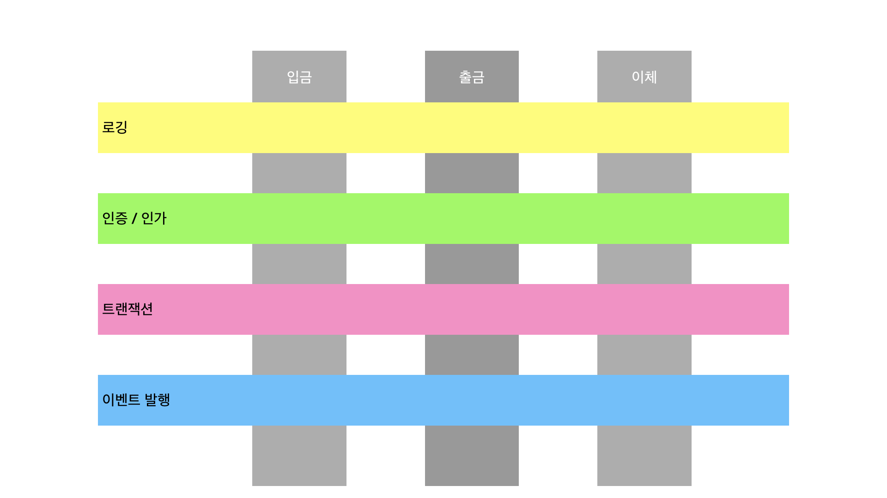
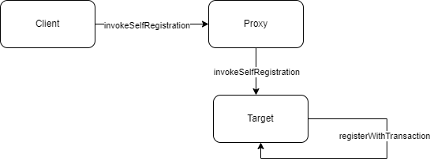

# AOP in Java(with Kotlin)

# TL;DR

1. AOP는 **공통된 관심사**를 지닌 로직을 한 곳에 모음으로써 OOP를 보완한다.
2. Java의 AOP 구현체는 **JDK Dynamic Proxy**(RTW), **CGLib**(RTW), **AspectJ**(CTW, LTW)가 있다.
3. Spring은 (필요한 경우) **proxy를 생성**하여 **Bean을 등록**한다.
4. Spring은 기본적으로 CGLib(spring-boot), JDK Dynamic Proxy(spring)을 사용하여 proxy를 생성한다.
5. Spring proxy에서는 **Self-invocation 상황을 주의**해야 한다.
6. [JDK Dynamic Proxy, CGLib, AspectJ, Spring AOP 예제](https://github.com/osoniee/aop-sample)

# AOP(Aspect Oriented Programming)

## 의의

AOP는 관점 지향 프로그래밍(Aspect Oriented Programming)의 약자이다. 개발을 진행하다 보면 각 모듈들 간에 공통된 관심사(Cross-cutting concern, 횡단 관심사)가 생길 수밖에 없다. 다음 그림을 보자.



위 그림에서 입금, 출금, 이체는 각각 독립된 서비스 로직으로써 존재한다. 그런데 각각 서비스 로직에는 로깅, 인증&인가, 트랜잭션, 이벤트 발행과 같이 서비스 핵심 로직에는 포함된다고 할 수 없지만 반드시 이루어져야 하는 기능들이 존재한다. 이러한 기능들은 개발자가 집중해야 할 핵심 코드가 아님에도 불구하고 여러 메서드에 중복되어 나타나게 된다. AOP는 이러한 부가적 로직들을 관심사로 삼고 모듈화하여 객체 지향 프로그래밍을 보완한다.

# AOP in Java

Java에는 AOP를 실현을 위한 JDK dynamic proxy, CGLib, AspectJ 세 가지의 구현체가 존재한다. 앞의 두 구현체들은 AOP를 위해 proxy 패턴을 사용한다. AspectJ는 eclipse재단에서 만든 AOP 구현체로, 사실상의 Java 표준이라고 볼 수 있다.

## Terminology

AOP에서는 다음과 같은 용어들을 사용한다.

### Target

핵심 기능(종단 관심사)을 담고 있는 모듈 또는 메서드로 부가기능(횡단 관심사)을 부여하는 대상이다.

### Advice

핵심 기능(횡단 관심사)에 적용할 부가 기능(종단 관심사)을 담고 있는 모듈을 뜻한다.

### Join Point

advice가 적용되는 / 적용될 수 있는 지점을 의미한다.

### Pointcut

advice를 적용할 target을 설정하는 정규표현식이다.

### Weaving

weaving은 advice를 target에 연결하는 방식을 의미한다. 실제로 weaving이 이루어지는 시점에 따라 Compile Time Weaving, Runtime Weaving, Load Time Weaving 세 가지로 나눌 수 있다.

1. **Compile Time Weaving(CTW)**

   일반 javac 컴파일러가 아닌 커스텀 컴파일러를 사용한 weaving 방식이다. 이 방식은 컴파일 과정에서 바이트코드를 분석하고 조작하여 advice를 코드 내에 직접 삽입한다. AspectJ가 AspectJ Compiler(ajc)를 통해 이를 지원한다.

    - **Post-Compile Weaving**

      컴파일 이후 생성된 class파일을 조작하여 weaving을 실현한다. lombok 어노테이션이나 kotlin은 기본적으로 ajc가 컴파일할 수 없다. 하지만 lombok, kotlin도 결국 컴파일하면 class파일로 변환되기 때문에 이 방식을 사용하면 Aspect를 적용할 수 있다. 다만 컴파일을 두 번에 나누어 실행하는 것이므로 CTW보다 속도가 느리다.

2. **Runtime Weaving(RTW)**

   런타임 중 메서드 호출이 일어나면 proxy가 대신 이를 수행하는 식으로 weaving을 구현한다. 따라서 메서드 호출에 대해서만 advice 적용이 가능하다. JDK dynamic proxy와 CGLib이 이를 지원한다.

3. **Load Time Weaving(LTW)**

이는 class파일을 JVM이 로드할 때 바이트 코드를 조작해 weaving한다. CTW처럼 java파일이나 class파일을 미리 조작하지 않기 때문에 컴파일 시간을 빠르나, 오브젝트가 메모리에 올라가는 시점에 weaving이 이루어지므로 런타임 환경에서의 속도는 CTW보다 느리다.

## JDK dynamic proxy

이 방식은 JDK에서 `Reflection`을 통해 제공하는 방식으로, interface를 기반으로 하여 proxy를 생성한다. 따라서 인터페이스가 필수적으로 존재해야 한다.

**예제**

```kotlin
interface Flyable {
    fun fly()
    fun fall()
}
```

```kotlin
class IronMan: Flyable {
    override fun fly() {
        println("-------I am Iron Man-------")
    }

    override fun fall() {
        println("-------I love you 3000-------")
    }
}
```

```kotlin
import java.lang.reflect.InvocationHandler
import java.lang.reflect.Method

class DynamicProxyHandler(private val target: Any): InvocationHandler {
    override fun invoke(proxy: Any?, method: Method?, args: Array<out Any>?): Any? {
        println("__________before invoke___________")
        return when (method?.name) {
            "fly" -> {
                println("__________invoke fly___________")
                return method.invoke(target, *args.orEmpty())
            }

            "fall" -> {
                println("__________invoke fall___________")
                return method.invoke(target, *args.orEmpty())
            }

            else -> method?.invoke(target, *args.orEmpty())
        }

    }
}
```

```kotlin
class DynamicProxyTest {
    @Test
    fun dynamicProxyTest() {
        val ironMan = Proxy.newProxyInstance(
            Flyable::class.java.classLoader,
            arrayOf(Flyable::class.java) as Array<Class<*>>,
            DynamicProxyHandler(IronMan())
        ) as Flyable
        ironMan.fly()
        ironMan.fall()
    }
}
```

결과:

```
__________before invoke___________
__________invoke fly___________
-------I am Iron Man-------
__________before invoke___________
__________invoke fall___________
-------I love you 3000-------
```

JDK dynamic proxy는 인터페이스 설정이 필수적이다. 인터페이스 없이 proxy 패턴을 사용하기 위해서는 CGLib을 사용해야 한다.

## CGLib

CGLib은 JDK dynamic proxy처럼 reflection 방식 `InvocationHandler`를 사용할 수도 있고, 이와  다르게 클래스 기반으로 바이트코드를 조작하여 proxy를 생성할 수도 있다. 이를 위해 ASM이라는 Java 바이트코드 분석 및 조작 프레임워크를 사용한다.

이 proxy는 JDK dynamic proxy와는 다르게 대상 클래스를 상속받는 클래스를 만든다. 바이트코드를 사용해 proxy를 만듦으로써 JDK dynamic proxy보다 성능은 우수하지만, 클래스 상속 방식을 사용하기 때문에 final 또는 private으로 선언된(오버라이딩을 지원하지 않는) 메서드나 필드, 생성자는 proxy에서 advice를 적용할 수 없다.

**따라서 kotlin class의 proxy를 만들려면 클래스 선언을 `open class` 로 해야 한다.**

```kotlin
implementation("cglib:cglib:3.3.0")
```

```kotlin
open class IronMan: Flyable {
    fun fly() {
        println("-------I am Iron Man-------")
    }

    fun fall() {
        println("-------I love you 3000-------")
    }
}
```

### InvocationHandler 방식

CGLib의 `InvocationHandler` 는 JDK dynamic proxy와 사용 방식이 거의 같다.  `java.lang.reflect.InvocationHandler` 가 아니라 `net.sf.cglib.proxy.InvocationHandler` 를 사용한다는 점만 다르다.

```java
import net.sf.cglib.proxy.InvocationHandler
import java.lang.reflect.Method

class CGLibInvocationHandler(private val target: Any): InvocationHandler {
    override fun invoke(proxy: Any?, method: Method?, args: Array<out Any>?): Any? {
        println("__________before invoke___________")
        return when (method?.name) {
            "fly" -> {
                println("__________invoke fly___________")
                return method.invoke(target, *args.orEmpty())
            }

            "fall" -> {
                println("__________invoke fall___________")
                return method.invoke(target, *args.orEmpty())
            }

            else -> method?.invoke(target, *args.orEmpty())
        }
    }
}
```

테스트:

```java
import com.example.aop.java.fly.IronMan;
import com.example.aop.java.proxy.CGLibHandler;
import net.sf.cglib.proxy.Enhancer;
import org.junit.jupiter.api.Test;

class CGLibTest {
	@Test
  void invocationHandlerTest() {
    Enhancer ironManEnhancer = new Enhancer(); // Enhancer는 proxy 객체이다.
    ironManEnhancer.setSuperclass(IronMan.class);
    ironManEnhancer.setCallback(new CGLibInvocationHandler(new IronMan()));
    IronMan ironMan = (IronMan) ironManEnhancer.create();

    System.out.println("fly");
    ironMan.fly();
    System.out.println("fall");
    ironMan.fall();
    }
}
```

결과:

```
fly
__________before invoke___________
__________invoke fly___________
-------I am Iron Man-------
fall
__________before invoke___________
__________invoke fall___________
-------I love you 3000-------
```

### MethodInterceptor 방식

```java
import net.sf.cglib.proxy.MethodInterceptor
import net.sf.cglib.proxy.MethodProxy
import java.lang.reflect.Method

class CGLibMethodInterceptor: MethodInterceptor {
    override fun intercept(obj: Any?, method: Method?, args: Array<out Any>?, proxy: MethodProxy?): Any? = when(method?.name) {
            "fly" -> {
                println("_________catched fly_________")
                val result = proxy?.invokeSuper(obj, args)
                println("_________invoked fly_________")
                result
            }

            "fall" -> {
                println("_________catched fall_________")
                val result = proxy?.invokeSuper(obj, args)
                println("_________invoked fall_________")
                result
            }

            else -> proxy?.invokeSuper(obj, args)

    }
}
```

테스트:

```java
class MethodInterceptorTest {
    @Test
    fun interceptorTest() {
        val ironManEnhancer = Enhancer()
        ironManEnhancer.setSuperclass(IronMan::class.java)
        ironManEnhancer.setCallback(CGLibMethodInterceptor())
        val ironMan = ironManEnhancer.create() as IronMan

        println("fly")
        ironMan.fly()
        println("fall")
        ironMan.fall()
    }
}
```

결과:

```
fly
_________catched fly_________
-------I am Iron Man-------
_________invoked fly_________
fall
_________catched fall_________
-------I love you 3000-------
_________invoked fall_________
```

`CallbackFilter`를 구현하여 interceptor를 지정할 수 있다.

```java
import net.sf.cglib.proxy.CallbackFilter
import java.lang.reflect.Method

class FlyableCallbackFilter: CallbackFilter {
    override fun accept(method: Method?): Int = when(method?.name) {
        "fly" -> 0
        "fall" -> 1
        else -> 2
    }
}
```

interceptors:

```java
import net.sf.cglib.proxy.MethodInterceptor
import net.sf.cglib.proxy.MethodProxy
import java.lang.reflect.Method

class FlyInterceptor: MethodInterceptor {
    override fun intercept(obj: Any?, method: Method?, args: Array<out Any>?, proxy: MethodProxy?): Any? {
        println("_________intercepted fly_________")
        return proxy?.invokeSuper(obj, args)
    }
}

class FallInterceptor: MethodInterceptor {
    override fun intercept(obj: Any?, method: Method?, args: Array<out Any>?, proxy: MethodProxy?): Any? {
        println("_________intercepted fall_________")
        return proxy?.invokeSuper(obj, args)
    }
}
```

테스트:

```kotlin
		@Test
    fun interceptorWithFilterTest() {
        val ironManEnhancer = Enhancer()
        ironManEnhancer.setSuperclass(IronMan::class.java)
        ironManEnhancer.setCallbackFilter(FlyableCallbackFilter())
        ironManEnhancer.setCallbacks(
            arrayOf(
                FlyInterceptor(),
                FallInterceptor(),
                NoOp.INSTANCE // default
            )
        )
        val ironMan = ironManEnhancer.create() as IronMan
        println("fly")
        ironMan.fly()
        println("fall")
        ironMan.fall()
    }
```

결과:

```
fly
_________intercepted fly_________
-------I am Iron Man-------
fall
_________intercepted fall_________
-------I love you 3000-------
```

## AspectJ

[https://eclipse.dev/aspectj/](https://eclipse.dev/aspectj/)

AspectJ는 eclipse 재단에서 만든 라이브러리로, Java에서 완전한 AOP 솔루션을 위해 만든 사실상의 Java AOP 표준이다. AspectJ는 JDK Dynamic Proxy나 CGLib과는 다르게 runtime weaving이 아닌 compile time 또는 (jvm의) load time에 weaving을 실행할 수 있다. Spring AOP도 pointcut expression은 AspectJ의 문법을 차용하는 등 굉장히 성숙하고 발전된 AOP 구현체이다.

### Compile Time Weaving

CTW는 ajc가 컴파일을 담당하는데, ajc는 kotlin을 컴파일 할 수 없다. 따라서 Java코드를 사용하여 구현하여야 한다. 간단한 로깅을 해 보자.

`build.gradle.kts`

```kotlin
implementation("org.aspectj:aspectjweaver:1.9.19")
```

`Logged.java`

```java
@Retention(RetentionPolicy.RUNTIME)
@Target(ElementType.METHOD)
public @interface Logged {
    boolean logBefore() default true;
    boolean logAfter() default true;
    boolean logAround() default true;
}
```

`IronMan.java`

```java
public class IronMan {
    @Logged
    public void fly() {
        System.out.println("-------I am Iron Man-------");
    }

    @Logged
    public void fall() {
        System.out.println("-------I love you 3000-------");
    }
}
```

`LogAspect.java`

```java
@Aspect
public class LogAspect {
    @Pointcut("@annotation(logged)")
    public void loggedPointCut(Logged logged) { }

    @Around("loggedPointCut(logged)")
    public Object logAround(ProceedingJoinPoint joinPoint, Logged logged) throws Throwable {
        if (!logged.logAround()) return joinPoint.proceed();
        Object returnValue;
        System.out.println("_____________around start____________");
        returnValue = joinPoint.proceed();
        System.out.println("_____________around end______________");
        return returnValue;
    }

    @Before("loggedPointCut(logged)")
    public void logBefore(Logged logged) {
        if (!logged.logBefore()) return;
        System.out.println("_____________before__________________");
    }

    @After("loggedPointCut(logged)")
    public void logAfter(Logged logged) {
        if (!logged.logAfter()) return;
        System.out.println("_____________after___________________");
    }
}
```

compile시 weaving을 진행하려면 javac가 아닌 [ajc(링크)](https://mvnrepository.com/artifact/org.aspectj/aspectjtools)로 컴파일을 진행해야 한다.

intellij를 사용한다면 다음과 같이 편하게 설정할 수 있다.

<aside>
⚙️ settings → java compiler → use compiler: Ajc | Path to aspectjtools.jar 설정

</aside>

그렇지 않다면 [이 플러그인](https://plugins.gradle.org/plugin/io.freefair.aspectj)을 사용하면 된다.

테스트:

```java
@Test
void aspectjTest() {
    IronMan ironMan = new IronMan();
    System.out.println("fly");
    ironMan.fly();
    System.out.println("fall");
    ironMan.fall();
}
```

결과:

```
fly
_____________around start____________
_____________before__________________
-------I am Iron Man-------
_____________around end______________
_____________after___________________
fall
_____________around start____________
_____________before__________________
-------I love you 3000-------
_____________around end______________
_____________after___________________
```

컴파일된 `IronMan.java`를 보면 다음과 같이 소스코드가 변형되어 있다.

```java
public class IronMan {
    public IronMan() {
    }

    @Logged
    public void fly() {
        JoinPoint var1 = Factory.makeJP(ajc$tjp_0, this, this);

        LogAspect var10000;
        Annotation var10001;
        try {
            LogAspect var10002 = LogAspect.aspectOf();
            ProceedingJoinPoint var10003 = (ProceedingJoinPoint)var1;
            Annotation var10004 = ajc$anno$0;
            if (var10004 == null) {
                var10004 = ajc$anno$0 = IronMan.class.getDeclaredMethod("fly").getAnnotation(Logged.class);
            }

            fly_aroundBody1$advice(this, var1, var10002, var10003, (Logged)var10004);
        } catch (Throwable var3) {
            var10000 = LogAspect.aspectOf();
            var10001 = ajc$anno$0;
            if (var10001 == null) {
                var10001 = ajc$anno$0 = IronMan.class.getDeclaredMethod("fly").getAnnotation(Logged.class);
            }

            var10000.logAfter((Logged)var10001);
            throw var3;
        }

        var10000 = LogAspect.aspectOf();
        var10001 = ajc$anno$0;
        if (var10001 == null) {
            var10001 = ajc$anno$0 = IronMan.class.getDeclaredMethod("fly").getAnnotation(Logged.class);
        }

        var10000.logAfter((Logged)var10001);
    }

    @Logged
    public void fall() {
        JoinPoint var1 = Factory.makeJP(ajc$tjp_1, this, this);

        LogAspect var10000;
        Annotation var10001;
        try {
            LogAspect var10002 = LogAspect.aspectOf();
            ProceedingJoinPoint var10003 = (ProceedingJoinPoint)var1;
            Annotation var10004 = ajc$anno$1;
            if (var10004 == null) {
                var10004 = ajc$anno$1 = IronMan.class.getDeclaredMethod("fall").getAnnotation(Logged.class);
            }

            fall_aroundBody3$advice(this, var1, var10002, var10003, (Logged)var10004);
        } catch (Throwable var3) {
            var10000 = LogAspect.aspectOf();
            var10001 = ajc$anno$1;
            if (var10001 == null) {
                var10001 = ajc$anno$1 = IronMan.class.getDeclaredMethod("fall").getAnnotation(Logged.class);
            }

            var10000.logAfter((Logged)var10001);
            throw var3;
        }

        var10000 = LogAspect.aspectOf();
        var10001 = ajc$anno$1;
        if (var10001 == null) {
            var10001 = ajc$anno$1 = IronMan.class.getDeclaredMethod("fall").getAnnotation(Logged.class);
        }

        var10000.logAfter((Logged)var10001);
    }

    static {
        ajc$preClinit();
    }
}
```

### Load Time Weaving, Post-Compile Weaving

이 둘은 IntelliJ보다는 [이 플러그인](https://plugins.gradle.org/plugin/io.freefair.aspectj)을 사용하는 게 좋다. 그리고 CTW와 달리 lombok, kotlin에서도 사용이 가능하다. 설정 및 테스트는 [이 예시](https://github.com/osoniee/aop-sample)에 구현해 두었다. 위 코드들도 전부 포함되어 있다.

# Spring AOP

## 개요

[https://docs.spring.io/spring-framework/reference/core/aop.html](https://docs.spring.io/spring-framework/reference/core/aop.html)

Spring AOP는 기본적으로 proxy를 사용한 RTW방식이다. Spring은 이를 JDK dynamic proxy또는 CGLib를 사용하여 구현하였다. 두 가지 모두를 사용하는 이유는 앞서 보았던 것처럼 JDK dynamic proxy는 Interface와 그 구현체가 존재해야 하기 때문이다. 따라서 Spring은 Interface가 존재하면 JDK dynamic proxy, 존재하지 않으면 CGLib을 사용하여 proxy를 생성한 후 이를 IOC컨테이너에서 관리한다.

하지만 Spring boot에서는 proxy를 생성할 때 기본적으로 CGLib을 사용한다(spring boot 2 이상). 이전에는 CGLib의 안정성(기본 생성자 필요 등) 때문에 JDK dynamic proxy를 함께 사용했지만, CGLib이 objensis를 차용함에 따라 안정성을 얻었다고 판단했다고 한다.

## @Transactional

`@Transactional` 은 Spring AOP패턴이 적용된 부분 중 아마 가장 많이 사용하고 있을 대표적인 사례이다. 알다시피 이는 jpa에서 데이터베이스와 연결된 작업의 단위를 지정하여 그 단위 내 작업이 정상적으로 이루어졌을 때만 데이터베이스에 commit한다.

하지만 문제는 이 AOP방식이 self-invocation이나 private 메서드에는 적용이 될 수 없다는 점이다. 다음 예시를 보자.

```kotlin
@Service
class FooTransactionService(private val fooStore: FooStore) {
    private val log = LoggerFactory.getLogger(this::class.java)

		fun invokeSelfRegistration() {
        log.debug("fun invokeSelfRegistration transaction: {}", TransactionSynchronizationManager.getCurrentTransactionName())
        fooStore.save(Foo(2))
        registerWithTransaction()
    }
		@Transactional
    fun registerWithTransaction() {
        log.debug("fun register transaction: {}", TransactionSynchronizationManager.getCurrentTransactionName())
        fooStore.save(Foo(1))
        throw RuntimeException("ERROR")
    }
}
```

알다시피 `invokeSelfRegistration`에서 실행한 `registerWithTransaction`메서드는 트랜잭션이 적용되지 않는다.

```
2023-07-31T12:56:21.922+09:00 DEBUG 7300 --- [    Test worker] c.e.a.s.c.service.FooTransactionService  : fun invokeSelfRegistration transaction: null
2023-07-31T12:56:21.941+09:00 TRACE 7300 --- [    Test worker] o.s.t.i.TransactionInterceptor           : Getting transaction for [org.springframework.data.jpa.repository.support.SimpleJpaRepository.save]
Hibernate: select f1_0.id from foo f1_0 where f1_0.id=?
2023-07-31T12:56:22.006+09:00 TRACE 7300 --- [    Test worker] o.s.t.i.TransactionInterceptor           : Completing transaction for [org.springframework.data.jpa.repository.support.SimpleJpaRepository.save]
2023-07-31T12:56:22.017+09:00 DEBUG 7300 --- [    Test worker] c.e.a.s.c.service.FooTransactionService  : fun register transaction: null
2023-07-31T12:56:22.019+09:00 TRACE 7300 --- [    Test worker] o.s.t.i.TransactionInterceptor           : Getting transaction for [org.springframework.data.jpa.repository.support.SimpleJpaRepository.save]
Hibernate: select f1_0.id from foo f1_0 where f1_0.id=?
2023-07-31T12:56:22.028+09:00 TRACE 7300 --- [    Test worker] o.s.t.i.TransactionInterceptor           : Completing transaction for [org.springframework.data.jpa.repository.support.SimpleJpaRepository.save]
```

```sql
mysql> select * from foo\G
*************************** 1. row ***************************
id: 1
*************************** 2. row ***************************
id: 2
2 rows in set (0.00 sec)
```

이는 proxy 패턴 전반적으로 나타나는데, proxy 객체에서 override된 `invokeSelfRegistration` 함수는 원본 객체의 `registerWithTransaction`를 부르기 때문이다. 이를 그림으로 나타내면 다음과 같다.



트랜잭션을 담당하는 것은 orverride된 Proxy 구현체의 함수이고, Target은 POJO에 불과하다. 따라서 Target에서 @Transaction어노테이션이 있는 메서드를 불러 봐야 Proxy객체에서 실행되지 않기 때문에 트랜잭션이 적용되지 않는다.

CGLib의 proxy는 기술적으로는 이를 해결할 수 있어 보인다. 하지만 Spring측에서는 이를 지원하지는 않는다.

위와 같은 문제에 봉착했을 때, 다음 네 가지 방법으로 풀어낼 수 있다.

1. Self-invocation상황을 피하는 것

   `registerWithTransaction`함수를 다른 class에서 구현한다.

2. `invokeSelfRegistration`에도 @Transactional 어노테이션 삽입

   @Transactional 어노테이션을 붙이면 `invokeSelfRegistration`을 실행할 때도 트랜잭션이 묶인다. 하지만 트랜잭션 정책을 커스텀하기 어렵다는 문제가 있다.

3. Self-injection

   Self-invocation 상황에서 자기 자신의 함수가 아닌 proxy 객체의 함수를 부른다.

    ```kotlin
    		@Autowired private lateinit var fooService: FooService;
    
    		fun invokeSelfRegistration() {
            log.debug("fun invokeSelfRegistration transaction: {}", TransactionSynchronizationManager.getCurrentTransactionName())
            fooStore.save(Foo(2))
            fooService.registerWithTransaction()
        }
    
    		@Transactional
        fun registerWithTransaction() {
            log.debug("fun register transaction: {}", TransactionSynchronizationManager.getCurrentTransactionName())
            fooStore.save(Foo(1))
            throw RuntimeException("ERROR")
        }
    ```

   이러면 의도한 바대로 동작한다. 하지만 지금 당신이 떠올렸듯이 아름답지 못하다.

4. AspectJ LTW

   Spring은 JDK Dynamic Proxy, CGLib를 통한 RTW뿐만 아니라 AspectJ를 사용한 LTW도 지원한다. 적용 방법은 [여기](https://docs.spring.io/spring-framework/reference/core/aop/using-aspectj.html)에, 구현한 프로젝트는 [앞서 언급한 링크](https://github.com/osoniee/aop-sample)에 있다. 설정 방법이 복잡하여 글에서는 다루지 않겠다.

   이를 사용하면 다음과 같은 결과를 얻을 수 있다.

    ```
    _____________before__________________
    2023-07-31T11:24:47.448+09:00 DEBUG 28676 --- [    Test worker] c.e.a.spring.aspectj.service.FooService  : invokeSelfRegistration transaction: null
    2023-07-31T11:24:47.509+09:00 TRACE 28676 --- [    Test worker] o.s.t.i.TransactionInterceptor           : Getting transaction for [org.springframework.data.jpa.repository.support.SimpleJpaRepository.save]
    Hibernate: select f1_0.id from foo f1_0 where f1_0.id=?
    2023-07-31T11:24:47.855+09:00 TRACE 28676 --- [    Test worker] o.s.t.i.TransactionInterceptor           : Completing transaction for [org.springframework.data.jpa.repository.support.SimpleJpaRepository.save]
    Hibernate: insert into foo (id) values (?)
    2023-07-31T11:24:47.944+09:00 DEBUG 28676 --- [    Test worker] c.e.a.spring.aspectj.service.FooService  : register transaction: com.example.aop.spring.aspectj.service.FooService.registerWithTransaction
    2023-07-31T11:24:47.944+09:00 TRACE 28676 --- [    Test worker] o.s.t.i.TransactionInterceptor           : Getting transaction for [org.springframework.data.jpa.repository.support.SimpleJpaRepository.save]
    Hibernate: select f1_0.id from foo f1_0 where f1_0.id=?
    2023-07-31T11:24:47.946+09:00 TRACE 28676 --- [    Test worker] o.s.t.i.TransactionInterceptor           : Completing transaction for [org.springframework.data.jpa.repository.support.SimpleJpaRepository.save]
    _____________after___________________
    ```

    ```sql
    mysql> select * from foo\G
    *************************** 1. row ***************************
    id: 2
    1 row in set (0.00 sec)
    ```


개인적으로는 1번 방식의 해결방안이 적절하다고 본다. 2, 3은 side effect가 존재하고, 4는 설정하기도 어려울 뿐더러 성능에도 악영향을 줄 수 있기 때문이다.

## 이외

Spring은 AspectJ LTW를 transaction 이외에도 Bean injection(@EnableSpringConfigured), 비동기(@Async, Future), Cache(@Cacheable, @Caching…)에도 제공한다([spring-aspects 패키지](https://mvnrepository.com/artifact/org.springframework/spring-aspects)).
`org.springframework:spring-aspects > META-INF > aop.xml`

```xml
<aspects>
		<aspect name="org.springframework.beans.factory.aspectj.AnnotationBeanConfigurerAspect"/>
		<aspect name="org.springframework.scheduling.aspectj.AnnotationAsyncExecutionAspect"/>
		<aspect name="org.springframework.transaction.aspectj.AnnotationTransactionAspect"/>
		<aspect name="org.springframework.transaction.aspectj.JtaAnnotationTransactionAspect"/>
		<aspect name="org.springframework.cache.aspectj.AnnotationCacheAspect"/>
		<aspect name="org.springframework.cache.aspectj.JCacheCacheAspect"/>
</aspects>
```

# 참고한 글

[https://docs.spring.io/spring-framework/reference/core/aop.html](https://docs.spring.io/spring-framework/reference/core/aop.html)

[https://velog.io/@suhongkim98/AOP](https://velog.io/@suhongkim98/AOP)

[https://medium.com/chequer/spring-transactional-caching-그리고-aspectj-1편-transactional-17eca8c33bf](https://medium.com/chequer/spring-transactional-caching-%EA%B7%B8%EB%A6%AC%EA%B3%A0-aspectj-1%ED%8E%B8-transactional-17eca8c33bf)
